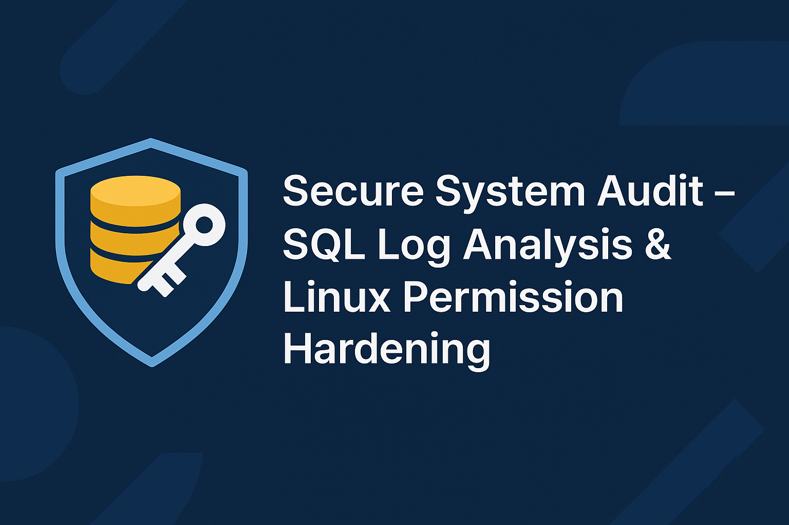

<p align="center">
  
</p>

# 🔐 Secure System Audit – SQL Log Analysis & Linux Permission Hardening

This project simulates a real-world security audit by analyzing authentication
logs using SQL and hardening Linux file permissions to enforce least-privilege
access. It demonstrates fundamental cybersecurity skills required for SOC,
system administration, and security engineering roles.

---

## 📘 Overview

The project is divided into two main components:

### 1️⃣ SQL Log Analysis
Investigates suspicious login activity using filters such as:
- After-hours access attempts  
- Unusual geographic locations  
- Date-based filtering for incident windows  
- Department-based retrieval for remediation  

### 2️⃣ Linux Permissions Audit
Assesses and corrects file and directory permissions by:
- Reviewing access levels using `ls -la`  
- Securing files with `chmod`  
- Restricting sensitive directories  
- Applying least-privilege principles  

---

## 📁 Project Structure

```
secure-system-audit-sql-linux/
│── README.md
│
├── sql-log-analysis/
│ └── sql_queries.md
│
├── linux-file-permissions/
│ └── commands.md
│
└── report/
└── mini_project_report.md

```

---

## 🧩 Part 1: SQL Log Analysis

The SQL portion focuses on extracting meaningful insights from the
`log_in_attempts` and `employees` tables to identify:
- Failed logins after business hours  
- Activity on specific suspicious dates  
- Login attempts originating outside approved regions  
- Employee lists filtered by building or department  

Full SQL queries are documented in:  
➡️ `sql-log-analysis/sql_queries.md`

---

## 🛡️ Part 2: Linux Permission Hardening

The Linux portion reviews permissions within a project directory and applies
corrective actions:
- Identifying overly permissive files  
- Securing archived files  
- Restricting directory access  
- Verifying updated permissions  

Complete Linux commands are documented in:  
➡️ `linux-file-permissions/commands.md`

---

## 🎯 Skills Demonstrated

- SQL log filtering & investigation  
- Identifying authentication anomalies  
- Linux file system security (rwx model)  
- Access control with `chmod`  
- Documentation & incident analysis  
- Understanding and applying least-privilege  

---

## 🛠️ Technologies Used
- SQL (Filtering & Analysis)
- Linux Shell  
- File Permission Utilities (`ls`, `chmod`)  

---

## 👨‍💻 Author
**Nirakar Mishra**  
Cybersecurity Analyst 

If you find this project useful, please ⭐ star the repository.

#### **Connect with me:**

- 🌐 [Portfolio](https://nirakaramishra-cse.github.io/Portfolio)  


